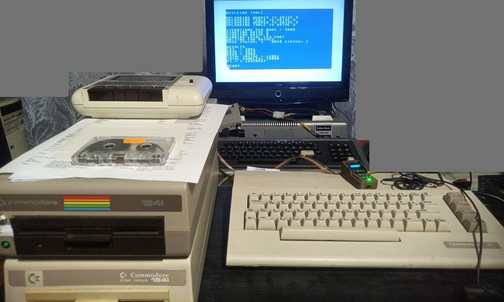
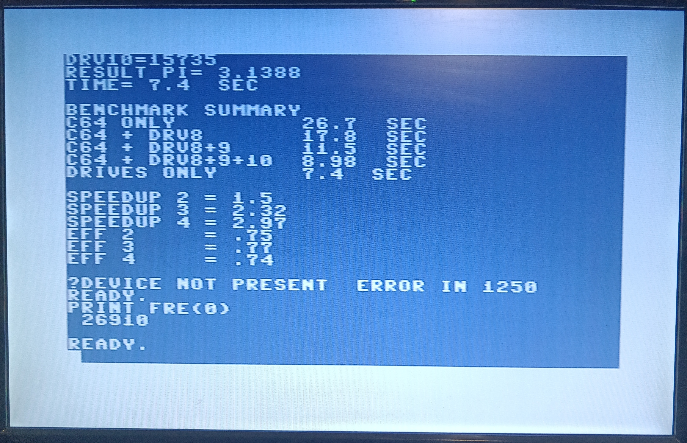

# C64/VIC-20 + 1541s Distributed Monte Carlo Benchmark


This project is a retrocomputing and computer architecture experiment: a Commodore 64 and up to three Commodore 1541 floppy disk drives are used as a tiny distributed system for estimating Pi with the Monte Carlo method. The repository also contains follow-up VIC-20 ports exploring the same 1541-as-coprocessor idea under much tighter memory constraints.

> Maybe this project is the most perverted thing I have ever coded :=)

Generative AI helped a lot – the project took a lot of time, and I would not have had enough time to complete it without LLMs, though I believe I "own every line of code". Though this text and most comments are written by me (and checked by Grammarly).

- [C64/VIC-20 + 1541s Distributed Monte Carlo Benchmark](#c64vic-20--1541s-distributed-monte-carlo-benchmark)
  - [Idea](#idea)
  - [Results, TL;DR](#results-tldr)
  - [VIC-20 follow-up experiments](#vic-20-follow-up-experiments)
    - [VIC-20 + 3K results](#vic-20--3k-results)
    - [Unexpanded VIC-20 BASIC host results](#unexpanded-vic-20-basic-host-results)
    - [Unexpanded VIC-20 ASM host results](#unexpanded-vic-20-asm-host-results)
  - [General review](#general-review)
  - [Testing](#testing)
  - [Theory](#theory)
    - [Working with disks](#working-with-disks)
      - [Bus and addressing](#bus-and-addressing)
      - [BASIC API](#basic-api)
    - [DOS commands](#dos-commands)
      - [M-R – memory-read](#m-r--memory-read)
      - [M-W -- memory-write](#m-w----memory-write)
      - [M-E – memory-execute](#m-e--memory-execute)
      - [User commands](#user-commands)
      - [Job queues](#job-queues)
    - [VIC-20 particulars](#vic-20-particulars)
      - [VIC-20 memory map](#vic-20-memory-map)
    - [Pseudo command line](#pseudo-command-line)
    - [UI+ and UI- for the 1541 DOS](#ui-and-ui--for-the-1541-dos)
  - [Note about the first attempt](#note-about-the-first-attempt)
    - [First VIC-20 attempt](#first-vic-20-attempt)
  - [Final architecture](#final-architecture)
    - [Algorithm for the C64](#algorithm-for-the-c64)
    - [Algorithm for the VIC-20](#algorithm-for-the-vic-20)
      - [VIC-20 + 3K](#vic-20--3k)
      - [VIC-20 unexpanded -- BASIC host](#vic-20-unexpanded----basic-host)
      - [VIC-20 unexpanded -- assembly host](#vic-20-unexpanded----assembly-host)
  - [Conclusions and future work](#conclusions-and-future-work)
  - [Sources](#sources)


## Idea

- Commodore 64 NTSC uses the MOS Technology 6510 CPU clocked at 1.023 MHz. 
- Commodore 1541 floppy disk drive (FDD) contains MOS 6502 with identical to 6510 ISA and instruction timing at 1 MHz.
- So, the CPU of the C64 and 1541 have almost the same computational power. 
- Additionally, 1541 is equipped with 2 KB RAM, which can be written, read by the C64, and executed by the 1541.  

So I decided to attempt to make a computational cluster from my C64, 1541, 1541-II, and Pi1541 cycle-accurate 1541 floppy emulator. 

> Note: Those computers are soooo slow that I am completely astonished and devastated -- how can developers make such great results with games and software for them! 

> Some photos of my C64 setup: [insta1](https://www.instagram.com/indrekis2/p/DVMok4ggt2Q/), [insta2](https://www.instagram.com/indrekis2/p/DVPPKpXAk93/).

## Results, TL;DR 

> **IMPORTANT NOTE!** Regarding the discrepancy between the wall-clock time and the reported time, especially for the computer-only runs, it was caused by using the wrong jiffy-rate conversion: the PAL value of 50 jiffies per second was used instead of the NTSC value of 60. Redoing all tests and recordings would be too time-consuming for this hobby project. The reported absolute times should therefore be corrected by a factor of $50/60$.  For example: $24 \cdot 50 / 60 = 20$. Relative values, such as speedups and scaling efficiencies, remain comparable. I'm deeply sorry! Added the recalculated (corrected) column to the tables.

By the wall clock (it is important – see below):

**VICE Emulator** 

| Experiment         | Reported, s  | Recalc., s | Efficiency | Wallclock, s | Efficiency |
| :----------------- | :----------- | ---------- | ---------- | :----------- | ---------- |
| C64 only           | 26.71 ± 0.01 | 22.25      |            | 22.7 ± 0.6   |            |
| C64 + Drv 8        | 17.73 ± 0.05 | 14.77      | 0.75       | 17.00 ± 0.05 | 0.67       |
| C64 + Drv 8, 9     | 11.52 ± 0.05 | 9.6        | 0.77       | 11.7 ± 0.6   | 0.65       |
| C64 + Drv 8, 9, 10 | 9.36 ± 0.25  | 7.8        | 0.71       | 10.00 ± 0.05 | 0.57       |
| Drv 8, 9, 10       | 7.88 ± 0.57  | 6.57       | 1.13       | 12.7 ± 0.6   | 0.60       |

> Note: By comparing the recalculated times with wall-clock times, one can clearly see the timer-stopping effect during bus operations.

**Real hardware**

| Experiment         | Reported, s  | Recalc., s | Efficiency | Wallclock, s | Efficiency |
| :----------------- | :----------- | ---------- | ---------- | :----------- | ---------- |
| C64 only           | 26.71 ± 0.01 | 22.26      |            | 22.1 ± 0.1   |            |
| C64 + Drv 8        | 17.73 ± 0.07 | 14.78      | 0.75       | 16.9 ± 0.1   | 0.66       |
| C64 + Drv 8, 9     | 11.54 ± 0.05 | 9.62       | 0.77       | 11.8 ± 0.1   | 0.63       |
| C64 + Drv 8, 9, 10 | 9.04 ± 0.09  | 7.53       | 0.74       | 9.6 ± 0.2    | 0.57       |
| Drv 8, 9, 10       | 7.66 ± 0.26  | 6.38       | 1.16       | 12.2 ± 0.2   | 0.60       |

Efficiency is $E = t_{C64}/t/N$, where N is the number of workers. The expected value is 1, with performance scaling linearly as we add new workers, though we sometimes see superlinear improvements.

Reported -- by the C64 timer.

Compared to reality, emulators are very precise. 

Results, reported by the C64 timer, are rather imprecise, though relevant. Only for the drives, the only error is substantial -- the relative error is large.

Regarding the Pi, a value close to 3.147 is obtained most of the time. Though at least once I obtained the 2.8…

Run on real hardware (better quality [here](https://github.com/indrekis/C64_HPC/blob/master/media/real_C64.mp4)): 

https://github.com/user-attachments/assets/a8c6c950-32e8-4cf4-80d8-aea2f9fc1d78

Run on VICE:

https://github.com/user-attachments/assets/e179a4fb-d9a0-4907-a1b8-4af4ab77b3c2

Run on Denise:

https://github.com/user-attachments/assets/1468dc6a-c9f7-4963-8a32-2abcc066fb9c


## VIC-20 follow-up experiments

The same idea was ported to the VIC-20 in three variants:

1. VIC-20 + 3K RAM expansion + 1541s, with the VIC-20 itself also doing work.
2. Unexpanded VIC-20 + 1541s, drive-only BASIC host.
3. Unexpanded VIC-20 + 1541s, assembly host with local VIC-20 worker.

Tests were less rigorous than for the C64; reproducibility was tested only basically, though across 3-5 runs, variations were minimal. Random errors in the tables below are less than 1s.

|  |
| ------------------------------------ |
| The VIC-20 screen is much smaller than that of the C64, so, despite my attempts, it is much more cryptic. So here are some explanations. The first line describes the run, including [UI mode](#ui-and-ui--for-the-1541-dos). The next two lines are the legend: K -- work is printed as kilo-iterations, 60 means 60'000 iterations; V -- VIC20 work part, 8 -- drive 8 work part, same for the 9 and 10, ``--`` means none. Next line for each run: Pi value obtained, time of calculations and efficiency, calculated by the T/Tn/N. The screen is from the  VIC-20 + 3K extender running on the VICE emulator. | 

### VIC-20 + 3K results

**VICE Emulator** 

| Experiment           | Reported, s | Recalc., s| Efficiency | Wallclock, s | Efficiency |
| :------------------- | :---------- | --------- | ---------- | :----------- | ---------- |
| VIC20 only           | 24.1        | 20.08     |            | 20           |            |
| VIC20 + Drv 8        | 16.6        | 13.83     | 0.73       | 15           | 0.67       |
| VIC20 + Drv 8, 9     | 11.7        | 9.75      | 0.69       | 11           | 0.44       |
| VIC20 + Drv 8, 9, 10 | 9.5         | 7.92      | 0.63       | 9            | 0.45       |
| Drv 8, 9, 10         | 11.6        | 9.67      | 0.69       | 12           | 0.55       |

**Real hardware**

| Experiment           | Reported, s | Recalc., s| Efficiency | Wallclock, s | Efficiency |
| :-----------------   | :---------- | --------- | ---------- | :----------- | ---------- |
| VIC20 only           | 24.1        | 20.08     |            | 21           |            |
| VIC20 + Drv 8        | 16.8        | 14.00     | 0.72       | 15           | 0.70       |
| VIC20 + Drv 8, 9     | 11.6        | 9.67      | 0.69       | 11           | 0.64       |
| VIC20 + Drv 8, 9, 10 | 9.5         | 7.92      | 0.63       | 9            | 0.58       |
| Drv 8, 9, 10         | 10.9        | 9.08      | 0.73       | 11           | 0.64       |

As can be seen, the reported results are highly consistent between hardware and emulation. Wall-clock results are consistent, too, within higher error margins. 

Scalability is similar to that of the C64 within error margins. Wallclock results for the VIC-20 are consistently smaller; it looks 10\% faster than the C64. Both are NTSC. Faster bus communication for the VIC-20 should not be important here. Other hypothesis -- VIC-II is stealing the bus on the C64.

Run on real hardware (better quality here):

Run on VICE:


### Unexpanded VIC-20 BASIC host results

**VICE Emulator** 

| Experiment   | Reported, s | Recalc., s| Efficiency | Wallclock, s | Efficiency |
| :----------- | :---------- | --------- | ---------- | :----------- | ---------- |
| Drv 8        | 38.4        | 32        |            | 34           |            |
| Drv 8, 9     | 19.2        | 16        | 1.00       | 19           | 0.89       |
| Drv 8, 9, 10 | 11.9        | 9.92      | 1.08       | 12           | 0.94       |

**Real hardware**

| Experiment   | Reported, s | Recalc., s| Efficiency | Wallclock, s | Efficiency |
| :----------- | :---------- | --------- | ---------- | :----------- | ---------- |
| Drv 8        | 38.3        | 31.92     |            | 34           |            |
| Drv 8, 9     | 17.7        | 14.75     | 1.08       | 18           | 0.94       |
| Drv 8, 9, 10 | 12.6        | 10.50     | 1.01       | 13           | 0.87       |


Run on real hardware (better quality here; first attempt always gives an error, as seen on the video, I do not have any idea why):


Run on VICE:


### Unexpanded VIC-20 ASM host results

**VICE Emulator** 

| Experiment           | Reported, s | Recalc., s| Efficiency | Wallclock, s | Efficiency |
| :------------------- | :---------- | --------- | ---------- | :----------- | ---------- |
| VIC20 only           | 23.3        | 19.42     |            | 19           |            |
| VIC20 + Drv 8        | 16.7        | 13.92     | 0.70       | 14           | 0.68       |
| VIC20 + Drv 8, 9     | 11.7        | 9.75      | 0.66       | 10           | 0.63       |
| VIC20 + Drv 8, 9, 10 | 8.6         | 7.17      | 0.68       | 9            | 0.53       |
| Drv 8, 9, 10         | 11.4        | 9.5       | 0.68       | 12           | 0.53       |

**Real hardware**

Absent yet
| Experiment           | Reported, s | Recalc., s| Efficiency | Wallclock, s | Efficiency |
| :-----------------   | :---------- | --------- | ---------- | :----------- | ---------- |
| VIC20 only           | 24.1        | 20.08     |            | 21           |            |
| VIC20 + Drv 8        | 16.8        | 14.00     | 0.72       | 15           | 0.70       |
| VIC20 + Drv 8, 9     | 11.6        | 9.67      | 0.69       | 11           | 0.64       |
| VIC20 + Drv 8, 9, 10 | 9.5         | 7.92      | 0.63       | 9            | 0.58       |
| Drv 8, 9, 10         | 10.9        | 9.08      | 0.73       | 11           | 0.64       |


Run on real hardware:


Run on VICE:


## General review

- Problem selected for computation -- calculating the Pi number using the Monte-Carlo sampling method.  
- Circle quarter coordinates are precalculated before the start.
- Code and table are uploaded to the disk drives before the start. 
- Calculations on the C64 are performed by the assembly code, too. 

For each point, two pseudo-random 8-bit coordinates are generated. The point is tested against a quarter circle:

$x^2 + y^2 <= 256^2$

To avoid an expensive multiplication or square root in the inner loop, the program precomputes a threshold table:

```text
Q[x] = floor(sqrt(65536 - x*x))
```

Then the test becomes:

```text
inside if y <= Q[x]
```

After all workers finish, the final estimate is:

```text
pi ≈ 4 * inside_count / total_points
```

The algorithm is embarrassingly parallel: each worker can generate and test its own random points independently. Only the final counts must be combined.

## Testing 

Testing of the C64 code was performed using the VICE emulator 3.10, Denise 2.5 (their results are consistent), and a real C64. Both the datasette and the disk drive emulator were used to upload the code to the real C64. 

The VIC-20 code was tested using the VICE emulator and a real VIC-20, both with and without a 3K RAM extender.

## Theory 

I had very limited experience with the C64 or VIC-20 and never worked directly with the Commodore 1541 DOS before. Here are some general notes for future me.

### Working with disks

#### Bus and addressing 

Disk drives are connected to the C64 via the [IEC Bus (Commodore serial bus)](https://www.pagetable.com/?p=1031), which is derived from a parallel IEEE-488 interface. Devices are addressed by device number and channel number.  Devices are chained serially. Global numbering is used for both local devices and devices connected via the IEC bus. Disk drive are assigned numbers 8,9,10,11. Example of the local device -- Datasette, type reader with number 1. 

Standard 1541 FDD is managed by Commodore DOS (CBM DOS) 2.6. There is a convention between the KERNAL -- C64 built-in OS and the 1541 DOS, about the channel number (secondary addresses):

- Channel 0 is used for loading PRG – programs, ch. 1 – for saving them.
- Ch. 2-14 are used for “ordinary” file data exchange. 
- Ch. 15 -- command/status channel. It is used to command the 1541 FDD; DOS interprets the commands and sends status through this channel. 

For the default 1541, the disk number is hardcoded to 8; changing it could be performed in two ways:

- Cut some traces on the board.
- Start as the default 8 and change the dedicated byte in the disk RAM ([requiring a dedicated dance of the powering drives and C64 on and off](https://forum.vcfed.org/index.php?threads/accessing-two-1541-drives.52744/post-639431)): 
``OPEN 15,8,15:PRINT#15,"M-W";CHR$(119);CHR$(0);CHR$(2);CHR$(41)+CHR$(73):CLOSE 15``. 

> Note: for many games, disk is hardcoded to 8 too – you start the game from the drive 10, and then it attempts to use drive 8 for its data… 

I have a standard (European edition) 1541-II (number 8), a user-modded 1541 (USA edition) with a switch to select 9 or 8, and Pi1541 is configured by the file on the SD card. 

|  | 
| :----: |
| My setup with an early test on screen. Pi1541 is on C64, above the keyboard. TRS-80 under the TV is unrelated to this project, it just lives there :=)  |

#### BASIC API

Commodore BASIC relies on the KERNAL routines to communicate with devices. For example: 

```basic
LOAD "PROGRAM",8
```

Loads (typically – BASIC) program from disk 8 (first FDD) to ``$0801`` location,

```basic
LOAD "PROGRAM",8,1
```

Loads from disk 8, using the address set in the first two bytes of the PRG file -- primitive relocation instrument. Address is stored as a little-endian -- bytes ``$01 $08`` corresponding to the ``$0801``. Both commands use channel 0.

> Note: to get list of files, we use:
> ```basic
> LOAD "$",8
> LIST
> ```
> And it overwrites current program in memory…


To open a file, we can use the following command:

```basic
OPEN 2,8,3,"0:FILENAME,S,W"
```

Where:

-  2 – File number used in the following operations to refer to this opened file (we have made much progress with automatically assigning the file numbers since those times :=).
- 8 – FDD number.
- 3 – channel to use.
- ``0:FILENAME,S,W`` string is sent to 1541 and DOS interprets it like this: 
  - ``0:`` drive number inside the FDD -- legacy from the dual-drive Commodore 4040 device, for 1541 and their newer models, always 0. Can be skipped, though its presence is reported to avoid some early 1541 DOS firmware bugs. 
  - ``FILENAME`` is self-explanatory.
  - ``,S`` – file type, sequential.
  - ``,W`` – open for write.

Typical operations with the file:

```basic
PRINT#2,"HELLO"
CLOSE 2
```

Other operations, such as deleting a file, can be performed using the command channel, where S -- SCRATCH, 1541 DOS name for delete/erase:

```basic
OPEN 15,8,15
PRINT#15,"S:FILENAME"
CLOSE 15
``` 

One can check the status of the last command in the following way (channel should be opened): 

```basic
1230 INPUT#15, EM, EN$, ET, ES
``` 

Where:

- ``EM`` -- error code (0 – no error).
- ``EN$`` -- string with error description (can also describe the successful operation).
- ``ET`` -- track number where the error occurred.
- ``ES`` -- block (sector) number where the error occurred.
- ``EN$`` is always a string; the other three can be read as a string or as a number.

> Note: INPUT does not work from the interactive mode -- only from the program mode. 

> Note 2: Spaces and comments use the precise memory, so in practice, they were sometimes considered harmful (keywords, such as INPUT, are saved in tokenized form, taking mostly 1 byte plus their arguments). Though for clarity and without having strong limits on memory, I use them extensively. 
>
> Though not for the VIC-20 -- memory constraints are too tight here.

### DOS commands

1541 DOS supports many commands. Among them are mentioned above ``S``, many commands for general use, such as ``N``/``NEW`` -- format disk, ``R``/``RENAME``, ``I0`` -- initialize disk, reread the so-called ``BAM`` (Block Availability Map), and so on. They are listed in the corresponding manuals. Important for this problem are the following:

#### M-R – memory-read

```basic
PRINT#15,  "M-R"+CHR$(LO)+CHR$(HI)
GET#15,A$ 
``` 

Memory read: read byte from 1541 RAM or ROM at the HI*256+LO, get is used to read the command result. 

#### M-W -- memory-write

```basic
PRINT#15,  "M-W"+CHR$(LO)+CHR$(HI)+CHR$(N)+DATA$ 
```

N – data size, ``DATA$`` -- string of bytes. Maximal N size – 35 bytes (I use 32). 

> Note: Data length is limited by the command length limit – 42 bytes, 41 characters are allowed. The command itself uses 6 bytes, so limit for data is 41-6=35.  See also [Commodore 1541 drive memory map](https://sta.c64.org/cbm1541mem.html) for  ``$0200-$0229``.

> Note: Basically, the default C64-1541 transfer speed is about 400 bytes/s. It is so slow that the entire fast loaders and fast loader cartridge industry emerged.

#### M-E – memory-execute 

```basic
PRINT#15,"M-E"+CHR$(0)+CHR$(5): REM EXECUTE CODE AT $0500
```

Code executed should end with RTS. On the C64, the PRINT command is blocked until then. 

> **Important remark**: BASIC timer, available through the TI C64 BASIC variable, stops while waiting for the PRINT. It had an interesting adverse effect, see later. Books call this effect “Timers can be unreliable”. 

#### User commands 

- U3 (synonym UC) – user command, executes code at the ``$0500``. 
- U4 (UD) – same, for the code at ``$0503``, 
- and so on: U5-U8 (UE-UH). 

Three bytes reserved are just enough for the jump. 

Other relevant: 

- U0 -- reset user jump table.
- U9 (UI) -- soft drive reset. 
- U: (UJ) -- hard reset. 

#### Job queues 

1541 DOS has one more interesting mechanism -- job queues. Technically, it is a small buffer of 6 bytes at ``$0000-$0005`` -- job slots. Drive code scans through this table, and if it sees a job code (bit 7 = 1), executes it and puts the result code in the same slot (the result code is distinguished by the bit 7 = 0; ``$01``  means ``OK``). 

Main job codes: 

- ``$80``  ``READ`` (read sector into buffer), 
- ``$90``  ``WRITE``, 
- ``$A0``  ``VERIFY``, 
- ``$B0``  ``SEEK``, 
- ``$C0``  ``BUMP`` (bump head to track 1), 
- ``$D0``  ``JUMP`` -- execute code in buffer,
- ``$E0``  ``EXECUTE`` -- execute code in buffer after motor/head ready. 

For each job slot, two memory blocks are associated: the track/sector number (``$0006/$0007`` for slot 0, ``$0008/$0009`` for slot 1, and so on) and the 256 bytes buffers where sector data can be stored for disk operations or code for execution:

- ``$0300-$03FF``  for job 0,
- ``$0400-$04FF`` for job 1,
- ``$0500-$05FF`` for job 2 (is called “user buffer”, so, I hope it is not used by the DOS itself),
- ``$0600-$06FF`` for job 3,
- ``$0700-$07FF`` for job 4,
- Slot for job 5 does not have a real buffer – not enough RAM in the 1541. 

As one can see from the available operation codes, this mechanism is extremely flexible. 

### VIC-20 particulars 


The VIC-20 is much more constrained computational environment. CPU is almost the same -- MOS 6502, at 1.023 MHz (for NTSC, PAL frequency is 1.108 MHz, more then for the C64). But the memory is much more limited: 5Kb RAM, of which only 3.5 Kb are free. Additionally, memory map is less flexible. 

Additionally, screen is almost twice as small then in C64 -- 22 cols and 23 rows vs 40 x 25 for the C64. 

> Note: as always, the lower are the resources, the harder is to separate abstractions. So here I describe both ideas behind the tricks used and the tricks itself.


#### VIC-20 memory map

| Address range | Area | Notes |
|---:|---|---|
| `$0000-$03FF` | Internal RAM, 1 KB | Zero page, stack, KERNAL/BASIC workspace, cassette buffer, system variables. |
| `$0400-$0FFF` | Empty / 3K expansion area | Unused on an unexpanded VIC-20. This is where the 3K RAM expansion appears.  BASIC starts here in the +3K configuration. |
| `$1000-$1DFF` | BASIC/user RAM | Default BASIC program area on an unexpanded VIC-20. |
| `$1E00-$1FFF` | Screen RAM | Default text screen memory. This is the upper practical limit for an unexpanded BASIC host that stores extra data below the screen. |
| `$2000-$7FFF` | Expansion blocks 1-3 | External RAM or ROM if expansion hardware is present, in 8K blocks. |
| `$8000-$8FFF` | Character ROM | Built-in character generator ROM. |
| `$9000-$93FF` | I/O area | VIC and VIA registers; VIC registers start at `$9000`. |
| `$9400-$95FF` | Color RAM in some expanded configurations | Used as color RAM location in some memory expansion configurations. |
| `$9600-$97FF` | Color RAM | Default color RAM for the unexpanded VIC-20. |
| `$9800-$9FFF` | Reserved / mostly unused | Not normally used by BASIC programs. |
| `$A000-$BFFF` | Expansion ROM area | Cartridge/expansion ROM area. |
| `$C000-$DFFF` | BASIC ROM | Built-in BASIC interpreter ROM. |
| `$E000-$FFFF` | KERNAL ROM | Built-in KERNAL ROM and vectors. |

At the ``$37-38`` (55-56 dec) there is end of BASIC variables and at the ``$2D-2E`` (45-45 dec) -- VARTAB, pointer to the start of the BASIC variables.

For the details, see also: [Changing Screen Dimensions on the Commodore VIC-20](https://techtinkering.com/articles/changing-screen-dimensions-on-the-commodore-vic-20/)

For VIC-20 + 3K configuration, we use the following memory layout:

| Address range | Description |
|---:|---|
| ``$0401-$????`` | Tokenized VIC-20 BASIC host/scheduler |
| ``$????-$15FF`` | BASIC dynamic area: scalar variables, arrays, strings, temporary string data |
| ``$1600-$17FF`` | VIC-20 local worker: code, parameters, result fields, and Q table |
| ``$1800-...``   | Embedded compact 1541 drive image, uploaded to each drive via M-W |
| ``$1D00-$1DFF`` | Spare / diagnostics / safety margin |
| ``$1E00-$1FFF`` |  Screen RAM |

Where the ??? is calculated by the build script, to put variables just above the tokenized BASIC codes. BASIC template contains placeholder for this:

```basic
100 poke45,000:poke46,000:poke55,0:poke56,22:clr
```

> Note: 22 is ``$16`` hex, so ``poke55,0:poke56,22`` sets variables limit to ``$1600``.

> Note 2: Looking ahead, both local and 1541 workers are added to the tokenized BASIC .prg-file as a blobs, not as DATA-blocks, located in the file so to be placed at expected locations in the RAM while loading. 

Additionally, fre(0) call is extensively used -- it has an side-effect of garbage collection, maximizing available memory. And I was forced  to remove many intermediate variables to squeeze code into available space. 

For the unexpanded VIC-20 with BASIC host, there are not enough RAM for the VIC-20 worker, so we use only 1541 for calculations. Corresponding memory map is:

| Address range | Description |
|---:|---|
| ``$1001-$????`` | Tokenized BASIC host/scheduler |
| ``$????-$DDDD`` | BASIC variables, arrays, and string space |
| ``$DDDD-$1DFF`` | Embedded compact 1541 drive image, uploaded to drives via `M-W` |
| ``$1E00-$1FFF`` | Screen RAM |

where ``$DDDD`` is computed by the following formula: 

``drive_image_address = $1E00 - compact_drive_image_length``

Corresponding BASIC placeholder (25 dec is a ``$19`` hex and 236 dec is ``$EC``: ``$19EC``):

```basic
100 poke45,000:poke46,000:poke55,236:poke56,25:clr
```

For the assembly host for the unexpanded VIC-20, memory map is the following:

| Address range | Description |
|---:|---|
| ``$0000-$03FF`` | VIC-20 internal low RAM: zero page, stack, KERNAL/BASIC workspace. The assembly code uses zero-page pointer ``$FB/$FC``. |
| ``$1001-$100C`` | Tiny BASIC loader stub: ``10 SYS 4112`` -- ``$1010``. |
| ``$100D-$100F`` | Padding. |
| ``$1010-...`` | Main 6502 assembly host/scheduler code. |
| ``...`` | KERNAL IEC routines, mode scheduler, local VIC Monte Carlo worker, timing/arithmetic/printing code. |
| `...` | Read-only data: strings, generated mode tables, and embedded compact 1541 drive image. |
| `...-$1DFF` | BSS/runtime variables used by the assembly host. Must still fit below screen memory. |
| `$1E00-$1FFF` | Default VIC-20 screen RAM. |

Current details can be seen in the ``vic20u_asm.map`` file.

> Note: ``$00FB-$00FE`` interval contains available locations in zero page.

### Pseudo command line 

To provide mode selection interesting trick was used.

For the VIC-20 + 3K, BASIC starts from the: 

```basic
1 poke828,86:poke829,50:poke830,0:goto 100
21 poke828,86:poke829,50:poke830,1:goto 100
22 poke828,86:poke829,50:poke830,2:goto 100
23 poke828,86:poke829,50:poke830,3:goto 100
24 poke828,86:poke829,50:poke830,4:goto 100
25 poke828,86:poke829,50:poke830,5:goto 100
30 poke828,86:poke829,50:poke830,255:goto 100
```

Addresses 828, 829, 830: ``$033C-$033E``, are the parts of the cassette buffer. We use them as an arguments block: 

- ``$033C`` = 86   ASCII "V",
- ``$033D`` = 50   ASCII "2",
- ``$033E`` = mode number.

> Note: 86,50 is just a signature to check if we have arguments.

> Note 2: this trick is useful, because CLR from the line 100 erases BASIC variables. 

So one can: 

| Command | Result |
| :-------|--------|
| RUN     | Start from the beginning, run all tests |
| RUN 21  | mode 1: VIC-20 only |
| RUN 22  | mode 2: VIC-20 + Drv.8 | 
| RUN 23  | mode 3: VIC-20 + Drv.8 + Drv.9 | 
| RUN 24  | mode 4: VIC-20 + Drv.8 + Drv.9 + Drv.10  |
| RUN 25  | mode 5: Drv.8 + Drv.9 + Drv.10 |
| RUN 30  | interactive menu |

For the unexpanded BASIC host, we support only 4 options:

| Command | Result |
| :-------|--------|
| RUN     | Start from the beginning, run all tests |
| RUN 21  | mode 2: Drv.8 | 
| RUN 22  | mode 3: Drv.8 + Drv.9 | 
| RUN 23  | mode 4: Drv.8 + Drv.9 + Drv.10  |

The unexpanded assembly variant always runs the full five-mode benchmark sequence. Internally, the modes are still present: the host keeps a `mode_idx`, loads the corresponding generated mode table, prints the mode line, runs it, and repeats until all five modes have completed.

### UI+ and UI- for the 1541 DOS 

For the compatibility with the C64, default 1541 communication mode is slower that it could be. The 1541 with default DOS can communicate by the IEC bus up to 25% faster. VIC-20 can work in this faster mode. To turn it on, one can send a command ``UI-`` and ``UI+`` to turn in off -- return to the compatible mode. 

> Note: I did not test thoroughly, but basically did not notice a difference between those modes.

## Note about the first attempt

The first attempt was straightforward. Blob of the binary code and its variables is written to the 1541s by the "M-W", executed by the "M-E," and the result is read by the “M-R”. Time was measured by the internal timer, accessible by the TI variable. Results looked promising -- the more 1541s were calculating, the faster the result was obtained. 

But something was wrong... Trying to fix it, I did the following. The C64 Monte-Carlo code was first written using BASIC and was too slow, so I replaced it with another blob, equivalent to the 1541 code, and added the ability to change C64 and 1541s weights -- because C64 is doing additional work. Then one thing started to be obvious. Times, printed by the program, showed rather good scaling with the number of 1541 workers, but it was clearly wrong. Using a manual stopwatch, I checked in the emulators and on real hardware -- calculation durations were practically the same regardless of the workers used.

To debug the problem, I added drive LED blinking while calculating the results. And the LED showed – drives are working sequentially. 

> Note: One should be extremely careful manipulating the LED state -- the same register is used for the motor control, and according to the books about the 1541, it can position the head in a position where it can be extracted only by disassembling the drive. Though the book says it is safe for the drive, I believe it can be damaged this way, or at least, I prefer not to test how much abuse a real 1541 mechanism can survive.
 
If I put ``RTS`` command in the calculation code, C64 can continue its work, but 1541 calculations are terminated. So, looked like my problem was impossible to solve. 

For two weeks of evenings, I tortured the AI and read the literature on the 1541 hardware and DOS to find a solution. All the AIs tried to persuade me that it is impossible. Only when I read about the work queue and U3 and friends user commands, AI believed me and helped to create a working code at last. 

**Takeout**: computers lied even decades before the LLM hallucinations -- it was unexpected to see correct results on the screen, while real results were totally wrong, as in a badly performed students' lab.

### First VIC-20 attempt 

It was related to using 1541s as a memory cache and was not that interesting.

## Final architecture

> Note: I had an inclination to call this part “Proposed solution” – our alumni should get this:=) 

### Algorithm for the C64

The table of circle quadrant is precalculated by the C64, and the code is uploaded onto 1541s before the time measurements start -- let us imagine that we run the code many times. In fact, I was more interested in parallel calculations, and uploading the code is slow and inherently sequential (I can imagine how it can be fixed by the custom fastloader, but it would be at least as difficult as the current project or even more). Additionally, though precalculating the table or, at least, moving its calculation to the drives can be useful at last from the total time required, I was too lazy to perform this refactoring for such an already long project. It also copies a blob of binary code for itself for uniformity.

|  | 
| :---: |
| Photo of the real calculations. The error occurred because I unintentionally turned off one of the FDDs during the final cleanup and reinitialization. |

C64 uploads the code binary blob to 1541, starting from ``$0300``, including: 

- Common routines, including the Monte Carlo code at ``$0300``.
- Jumps for the U3 (``$0500``) and U4 (``$0503``) commands and their corresponding handler subroutines (start_worker and stop_worker). 
- Two almost identical jobs -- A and B to ``$0600`` and ``$0700`` buffers (be careful -- ``$0700`` is reserved for the BAM -- Block Availability Map, critical disk structure, so overwriting it is risky unless the drive is kept under tight control).
  - Note: Uploading is non-optimal because many parts of the blob (``$0400`` and part of the ``$0500`` block) can be skipped.
- C64 uploads the precomputed TABLE to ``$0400``.
- C64 uploads computation input data to ``$05D0`` -- different for each drive.
- C64 sends the U3 command using the ``PRINT#D,"U3"`` command for each drive.
  - ``U3`` calls ``start_worker``, which puts job A (``$D0`` -- ``JUMP``) into the у job queue and returns. Then C64 can continue.
  - At the end of the job A, it puts job B into the queue (and vice versa).
  - As a result, the drive, scanning the job table, calls job A and job B in turn, performing the calculations. 
   - > Note 1: Two jobs switching from one to another are used to avoid race conditions with the error code in the job slot. I’m not sure if it is the optimal solution, but it works. 
- After the C64 finishes its own work, it can query the results of the 1541s using the ``M-R`` command and send ``U4`` to stop workers. 

So the calculation looks like:

```text
start_worker -> queue A

A:
  step_chunk
  queue B
  RTS

B:
  step_chunk
  queue A
  RTS

A:
  ...
```

Every 256 chunks, the LED state is changed. This is done by directly manipulating the VIA port register (which corresponds to the second VIA 6522  -- Versatile Interface Adapter, I/O port controller, of the 1541, responsible for the):

```text
VIA PRB  = $1C00  -- Port Register B / DSKCNT
VIA DDRB = $1C02 -- Data Direction Register B
LED bit  = $08 – bit 3 mask 
Note: bits 0-1 control the stepper phase, and bit 2 controls the spindle motor.
```

Default C64 memory layout:

```text
$C000  C64 worker code
$C100  C64 worker parameters and result
$C200  C64 copy of the threshold table Q[0..255]
```
It is executed by the command “SYS 49152” (SYS 49152). 

1541 memory layout:

```text
$0300  common routines
$0400  threshold table Q[0..255]
$0500  U3/U4 entry stubs
$0520  start routine
$0560  stop routine
$05D0  parameters and result
$0600  job A
$0700  job B
```

The parameter block at `$05D0` contains:

```text
$05D0  iteration count low byte
$05D1  iteration count high byte
$05D2  seed low byte
$05D3  status
$05D4  result low byte
$05D5  result high byte
$05D6  seed high byte
$05D7  temporary x
$05D8  job counter
$05D9  stop flag
$05DA  temporary flag
$05DB  blink counter
```

The status byte is used as follows:

- 1 -- running,
- 2 -- finished,
- 3 -- stopped.

The C64 polls the drive status byte at `$05D3`. 


An important constant here is the DRIVE_CHUNK — the number of Monte-Carlo iterations for one job quantum. The more the better, but it looks like value 32 is optimal: for 16 calculations are too slow, and for 64 drives calculate almost sequentially. Looks like long jobs somehow starve the drives of returning control to the C64 (e.g., by not freeing the bus). Though here it is just a hypothesis.

> Note: In the emulators, for the current code, LEDs are blinking continuously since the moment the code started. On the real C64, they light up but don't blink until the C64 has finished its calculations. I am not sure what this means, because the timings are fairly consistent across the emulators and hardware. 

Project code structure -- C64 part:

```text
src/
  benchmark.bas.in       BASIC V2 template for the C64 benchmark
  c64_worker.asm         6510/6502 worker code executed on the C64
  drive_worker.asm       6502 worker code executed inside each 1541
  generated_*.inc        generated assembler constants
  generated_*.cfg        generated ld65 memory maps

tools/
  config.py              benchmark and memory-layout configuration
  make_includes.py       generates ca65 includes and ld65 configs
  make_basic.py          embeds worker binaries into BASIC DATA

Makefile                 build rules
seq3vis.bas              vibecoded Monte Carlo demo
```

- Code is generated from the templates, and blobs are created using Python 3. 
- Assembly code is compiled using the ca65 assembler and ld65 linker from the cc65 package for the 6502-based systems. https://cc65.github.io/ 
- A tokenized BASIC PRG-file is created using the petcat from the VICE emulator package, and disk images are created using the c1541 from the same package. 
- VICE and Denise emulators were used for testing.
- C64 Studio was used as an auxiliary but useful tool -- it allows one to check the generated BASIC code and run it in VICE with a single shortcut. 


The **Makefile** is used to generate the final PRG and C64 disk image. Targets: 

- make     --    build benchmark.prg
- make disk  --   build benchmark.d64
- make clean  -- remove generated files and build output


**src/benchmark.bas.in** -- template for the main C64 BASIC V2 program. This file contains the C64 code.

The file contains placeholders such as:

- {TOTAL_WORK}
- {DRIVE_CHUNK}
- {DRIVE_DATA}
- {C64_DATA}

These are replaced by **tools/make_basic.py**.

**src/c64_worker.asm** -- 6502/6510 assembly code executed on the C64 itself. Uses constants from the generated file "**generated_c64.inc**", with addresses to be used by the code.

**src/drive_worker.asm** -- 6502 assembly code executed inside each 1541 disk drive. Uses constants from the generated file "**generated_drive.inc**", with addresses and other constants to be used by the code.

Generated .inc-files are created by the **tools/make_includes.py**, based on the configuration from the **tools/config.py**. Other important generated files are the **generated_c64.cfg** and **generated_drive.cfg** -- configurations for the linker, describing the exact memory layouts. 

Among other things, **tools/config.py** contains TOTAL_WORK (total Monte-Carlo iterations – 16-bit value) and DRIVE_CHUNK, C64_WEIGHT and DRIVE_WEIGHT parameters. 

**tools/make_basic.py** builds the final BASIC file, reading build/drive_worker.prg, build/c64_worker.prg, and src/benchmark.bas.in and embedding the worker binaries into BASIC DATA statements. 

Final files, depending on requirement, are:

- build/benchmark.bas
- build/benchmark.prg
- build/benchmark.d64

> Note: not all values can be freely changed in configurations (some are partially hardcoded, directly or semantically, see sources) -- I have not addressed this deficiency yet.

To run the code, use: 

```basic
LOAD"BENCHMARK",8
RUN
```

### Algorithm for the VIC-20

Toolchain used is the same as for the C64. Makefile is common. 

Project code structure -- VIC-20 part:

```text
src/
  drive_worker.asm          shared 6502 worker code executed inside each 1541
  vic20_benchmark.bas.in    BASIC V2 template for the VIC-20 + 3K benchmark host
  vic20_worker.asm          6502 local worker code executed on the VIC-20 + 3K
  vic20u_benchmark.bas.in   BASIC V2 template for the unexpanded VIC-20 drive-only host
  vic20u_asm.asm            one-file unexpanded VIC-20 assembly benchmark with BASIC SYS stub
  generated_vic20.inc       generated ca65 constants for the VIC-20 + 3K worker
  generated_vic20.cfg       generated ld65 memory map for the VIC-20 + 3K worker
  generated_vic20u_asm.inc  generated constants and mode tables for the unexpanded VIC-20 asm host
  generated_vic20u_asm.cfg  generated ld65 memory map for the unexpanded VIC-20 asm host

tools/
  config.py                 shared benchmark, memory-layout, timing, and seed configuration
  make_includes.py          generates ca65 includes and ld65 configs
  make_vic20_basic.py       builds the VIC-20 + 3K BASIC host and appends worker/drive blobs
  make_vic20u_basic.py      builds the unexpanded VIC-20 BASIC drive-only host
  make_vic20u_asm_inc.py    generates constants and mode tables for the unexpanded VIC-20 asm variant
  report_vic20u_asm_size.py reports whether the unexpanded VIC-20 asm PRG still fits below screen RAM
```

Comments are absent in the BAS files, because of the tight memory constraints, so some details are here. 

Details regarding the mode selection and the memory maps are described in the [VIC-20 particulars](#vic-20-particulars). Additionally, ``make_vic20_basic.py`` and ``make_vic20u_basic.py`` build final .prg files, concatenating tokenized basic files and workers to provide expected by the code layout.

Because of the small screen, work is printed as thousands: 60 means 60K -- 60000 iterations, and so on.

#### VIC-20 + 3K 

**TODO: SCreen**

Lines 110–140 define the BASIC runtime constants used by the VIC-20 + 3K host and set by the corresponding Python script:

- `tw` — total amount of Monte Carlo iterations per benchmark mode,
- `di` — address of the embedded 1541 drive image in VIC-20 RAM,
- `dl` — length of the embedded 1541 drive image,
- `da` — load address of the drive image in 1541 RAM,
- `dp` — address of the 1541 worker parameter block,
- `ds` — address of the 1541 worker status byte,
- `dr` — address of the 1541 worker result counter,
- `va` — address of the local VIC-20 worker,
- `jy` — number of KERNAL jiffies per second, used for timing,
- `vw` / `dw` — work-distribution weights for the VIC-20 worker and each 1541 drive worker,
- `mc` — number of benchmark modes.

Instead of the DATA block,direct ``PEEK(di+p+i)`` is used to read the 1541 worker, and VIC-20 worker is executed in place.

Subroutines:

- 910   Run one selected benchmark mode.
- 1010  Select which workers are active for the current mode.
- 1110  Open the drive command channel in "UI-" mode for the drive d.
- 1210  Stop and close the drives used by the current benchmark mode. Additionally collects garbage by the fre(0).
- 2010  Upload the embedded drive image to 1541 RAM using M-W. Collects garbage.
- 4010  Write the iteration count and seed, and clear the status/result fields.
- 5010  Start the 1541 worker with U3.
- 6010  Read the worker status byte using M-R.
- 6110  Read the result counter low/high bytes using M-R.
- 6210  Collect drive results and compute Pi, elapsed time, and scaling efficiency and print them.
- 7010  Run the local VIC-20 worker. The worker is called by the ``SYS {VIC_WORKER_ADDR}``.
- 8010  Compute the work distribution for the selected benchmark mode.
- 8200  Start the active VIC-20/1541 workers and print the compact work summary.
- 8300  Analyze polled active drives status until all drive workers have finished.
- 8600  Print one compact work-size field in the mode summary line.


#### VIC-20 unexpanded -- BASIC host

The unexpanded VIC-20 BASIC host is the most memory-constrained variant. I was forced to replace many variables by the generated placeholders to minimize memory usage. It does not run a local VIC-20 worker; the VIC-20 acts only as a scheduler, loader, timer, and result collector for one, two, or three 1541 drives.

Variables: 

- `tw` — total amount of Monte Carlo iterations per benchmark mode,
- `di` — address of the embedded compact 1541 drive image in VIC-20 RAM,
- `dl` — length of the embedded compact 1541 drive image,
- `dp` — address of the 1541 worker parameter block.


Subroutines:

- 900   Run one selected drive-only benchmark mode.
- 1100  Open the drive command channel in `"UI-"` mode for drive `d`.
- 2000  Upload the embedded compact drive image to 1541 RAM using `M-W`. Also forces garbage collection with `FRE(0)`.
- 4000  Write the iteration count and seed, and clear the status/result fields in the 1541 worker parameter block.
- 5000  Start the 1541 worker with `U3`.
- 6000  Read the 1541 worker status byte using `M-R`.
- 6100  Read the result counter low/high bytes using `M-R`.
- 6200  Collect finished drive results, compute Pi, elapsed time, and scaling efficiency, and print the compact result line.
- 8000  Compute the drive-only work distribution for the selected mode.
- 8200  Print the compact per-mode work summary and start the active 1541 workers.
- 8300  Poll active drives until all drive workers have finished.
- 8600  Print one compact work-size field in the mode summary line.


#### VIC-20 unexpanded -- assembly host


## Conclusions and future work

Thanks to the intellectual disk drives, the C64 became a small heterogeneous computational cluster. 

The numerical problem is embarrassingly parallel -- each Monte Carlo sample is independent. No worker needs data from another worker during the computation. So, from the algorithmic point of view, it is the simplest possible problem to parallelize – most problems were technical. 

As a result, obtained scalability, with efficiency about 0.6-0.7, is "not great, not terrible" -- much worst than it should be in real parallel calculations, better than I expected from such an exotic setup.

Let’s align our terminology with the terminology commonly used in HPC:

- The total number of samples is split before the run -- we have static scheduling. There is no dynamic work stealing.
- The C64 acts as the host, scheduler, loader, and result collector. Also, it is used as a worker to some extent. 
- The 1541 drives behave as very small asynchronous coprocessors.
- System is heterogeneous to some extent. 
  - C64 worker is a local CPU kernel. 
  - 1541 workers -- asynchronous device kernels.
  - IEC bus -- slow control and data interconnect.
  - M-W/M-R -- API for explicit memory transfer.
  - U3/U4 -- kernel launch and stop API.
  - job queue – internal cooperative device scheduler.

Related "competencies":

- 6502/6510 assembly programming;
- C64 BASIC programming;
- memory-mapped I/O;
- device firmware as an execution environment;
- host-device communication;
- asynchronous accelerators;
- job queues and cooperative scheduling;
- message granularity;
- static load balancing;
- speedup and efficiency;
- why “more processors” does not automatically mean “proportionally faster”.
- Additionally, without the LLMs I would never have finished this project – possibly never even started it.

Though the system is ancient and extremely slow by current standards, the ideas are still relevant and important. 

Future work could include optimizations and generalization:

- Uploading into two or more drives simultaneously
- Optimizing blob for uploading 
- Developing parallel programming framework for the C64 
- Adding ability to communicate [between the drives](https://forum.vcfed.org/index.php?threads/accessing-two-1541-drives.52744/).


## Sources

[CBM DOS ROM disassembly and memory variables for Commodore 1541 drive](https://g3sl.github.io/c1541rom.html)

[Commodore Peripheral Bus: Part 3: Commodore DOS](https://www.pagetable.com/?p=1038)

[Commodore 1541 / OC-118 Disk Drive Memory Map](https://www.zimmers.net/anonftp/pub/cbm/maps/C1541ram.txt)

[The Complete Commodore Inner Space Anthology](https://www.zimmers.net/anonftp/pub/cbm/manuals/anthology/400/index.html)

["The Anatomy of the 1541 Disk Drive" by Lothar Englisch, Norbert Szczepanowski](https://archive.org/details/The_Anatomy_of_the_1541_Disk_Drive)

["Inside Commodore DOS: The Complete Guide to the 1541 Disk Operating System" by Richard Immers, Gerald Neufeld](https://www.pagetable.com/docs/Inside%20Commodore%20DOS.pdf)


[Commodore 1541 Disk Drive User’s Guide / VIC-1541 Disk Drive User’s Manual](https://archive.org/details/Commodore_1541_Disk_Drive_Users_Guide_1982-09_Commodore)

